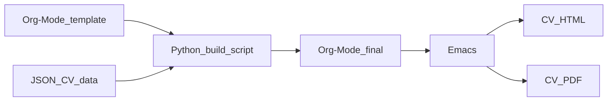

# Curriculum Vitae

CV generator utilizing a combination of Emacs Org-Mode, Python and JSON data. Works well for me and can easily be auto generated. I always have the newest versions as releases on Github, though I have redacted some information for privacy.

## Overview of build process

